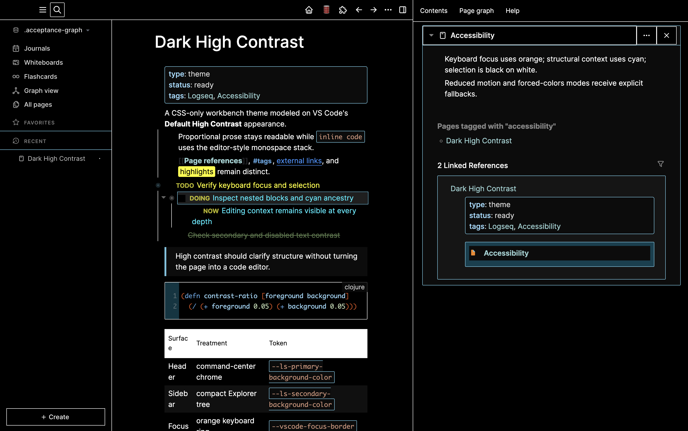
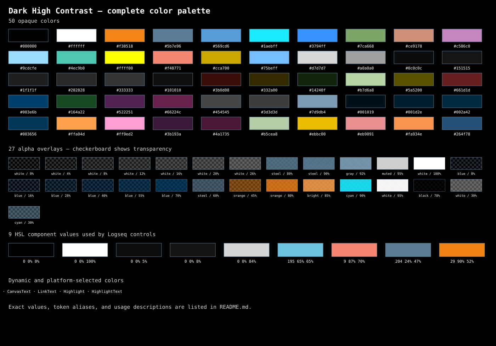

# Dark High Contrast for Logseq

A Logseq theme that adapts the visual language of Visual Studio Code's built-in **Dark High Contrast** theme to Logseq's classic/file-graph interface.



## Highlights

- Pure-black editor canvas with white text and structural borders.
- Orange keyboard-focus rings and cyan structural context.
- VS Code-inspired semantic colors for links, references, properties, tasks, and code.
- Compact workbench treatment for the header, sidebars, command palette, menus, dialogs, and settings.
- High-contrast coverage for queries, tables, notifications, PDF controls, graph filters, and whiteboard tools.
- Proportional Inter typography for notes; monospace remains limited to code and keyboard labels.
- Optionally hides the property table on blocks matching any number of property pairs (see below).
- Adds a passage block that reads as one of Logseq's named admonitions, with commands that resolve a Bible reference and insert one.
- No build runtime, tracking, remote imports, or network access.

## Color palette

`theme.css` is the source of truth for this palette. The chart shows every fixed color expression used by the theme; the tables below consolidate aliases that resolve to the same value and explain where each color appears.



<!-- fixed-color-values:start -->

### Core VS Code High Contrast colors

| Color | Tokens | Used for |
| --- | --- | --- |
| `#000000` | `--vscode-hc-black` | Primary canvas; editor, menus, dialogs, controls, code, whiteboards, and selected surfaces. |
| `#ffffff` | `--vscode-hc-white` | Primary text and icons, strong borders, bullets, scrollbars, and inverted selection backgrounds. |
| `#f38518` | `--vscode-hc-focus`, `--vscode-hc-orange` | Keyboard focus, active bullets, hover borders, editor focus, and primary interaction emphasis. |
| `#5b7e96` | `--vscode-hc-border` | Structural borders, guides, dividers, inactive controls, and the gray/accent ramps. |
| `#569cd6` | `--vscode-hc-blue` | Tags and syntax keywords. |
| `#1aebff` | `--vscode-hc-bright-blue` | Hovered links and tags and the brightest accent-scale text. |
| `#3794ff` | `--vscode-hc-link` | Links, whiteboard blue strokes, and quick-link hover states. |
| `#7ca668` | `--vscode-hc-green` | Comments and idle file-sync status. |
| `#ce9178` | `--vscode-hc-string` | Inline code and string syntax. |
| `#c586c0` | `--vscode-hc-purple` | Purple whiteboard strokes and syntax accents. |
| `#9cdcfe` | `--vscode-hc-cyan` | Page and block references and variable/property syntax. |
| `#4ec9b0` | `--vscode-hc-type` | Type and class-name syntax. |
| `#ffff00` | `--vscode-hc-yellow` | Clozes, marks, search matches, warnings, pending sync, and operators. |
| `#f48771` | `--vscode-hc-error` | Errors, destructive states, failed sync, and red whiteboard strokes. |
| `#cca700` | `--vscode-hc-warning` | Reserved VS Code warning token. |
| `#75beff` | `--vscode-hc-info` | Reserved VS Code information token. |
| `#d7d7d7` | `--vscode-hc-muted` | Secondary text, tertiary borders, and gray whiteboard strokes. |
| `#a0a0a0` | `--vscode-hc-disabled` | Disabled text and control borders. |
| `#0c0c0c` | `--vscode-hc-panel` | Secondary surfaces, properties, quotes, inline code, and nested panels. |
| `#151515` | `--vscode-hc-elevated` | Elevated and tertiary surfaces. |

### Neutral surfaces and structural ramps

| Color | Tokens or selectors | Used for |
| --- | --- | --- |
| `#101010` | `--ls-table-tr-even-background-color` | Alternating table rows. |
| `#1f1f1f` | `--ls-quaternary-background-color`, `--ls-quaternary-background-color1`, `--ls-bg-quaternary`, `--ls-block-highlight-color`, `--ls-color-level-3`, `--lx-gray-04` | Highlighted blocks and intermediate raised surfaces. |
| `#282828` | `--ls-quinary-background-color`, `--ls-color-level-4`, `--lx-gray-05`, `--ls-wb-background-color-gray` | Higher neutral surfaces and gray whiteboard objects. |
| `#333333` | `--ls-senary-background-color`, `--ls-color-level-5`, `--lx-gray-06` | High neutral surface steps. |
| `#3d3d3d` | `--ls-color-level-6`, `--lx-gray-07` | Strongest neutral surface before structural borders. |
| `#7d9db4` | `--lx-gray-10` | Radix gray solid-fill hover step. |
| `#001019` | `--lx-accent-02` | Subtle accent background. |
| `#001d2e` | `--lx-accent-03` | Accent component background. |
| `#002a42` | `--lx-accent-04` | Hovered accent component background. |
| `#003656` | `--lx-accent-05` | Active or selected accent component background. |
| `#003e6b` | `--lx-accent-06`, `--ls-highlight-color-blue`, `--ph-highlight-color-blue`, `--ls-whiteboard-quick-links-background`, `--ls-wb-background-color-blue` | Strong blue accent fill, blue highlights, PDF highlights, and whiteboard quick links. |
| `#ffa04d` | `--lx-accent-10` | Bright orange solid-fill hover step. |

### Semantic, syntax, highlight, PDF, whiteboard, and admonition colors

| Color | Tokens or selectors | Used for |
| --- | --- | --- |
| `#3b0d08` | `--ls-error-background-color`, `--ls-wb-background-color-red` | Dark error notifications and red whiteboard objects. |
| `#332a00` | `--ls-warning-background-color`, `--ls-wb-background-color-yellow` | Dark warning notifications and yellow whiteboard objects. |
| `#14240f` | `--ls-success-background-color`, `--ls-wb-background-color-green` | Dark success notifications and green whiteboard objects. |
| `#b7d6a8` | `--ls-success-text-color`, `--ls-wb-stroke-color-green` | Success foreground and green whiteboard strokes. |
| `#5a5200` | `--ls-highlight-color-yellow`, `--ph-highlight-color-yellow` | Yellow text and PDF highlights. |
| `#661d1d` | `--ls-highlight-color-red`, `--ph-highlight-color-red` | Red text and PDF highlights. |
| `#164a22` | `--ls-highlight-color-green`, `--ph-highlight-color-green` | Green text and PDF highlights. |
| `#522251` | `--ls-highlight-color-purple`, `--ph-highlight-color-purple` | Purple text and PDF highlights. |
| `#66224c` | `--ls-highlight-color-pink` | Pink text highlights. |
| `#454545` | `--ls-highlight-color-gray` | Gray text highlights. |
| `#ff9ed2` | `--ls-wb-stroke-color-pink` | Pink whiteboard strokes. |
| `#3b193a` | `--ls-wb-background-color-purple` | Purple whiteboard objects. |
| `#4a1735` | `--ls-wb-background-color-pink` | Pink whiteboard objects. |
| `#b5cea8` | `.cm-number`, `.hljs-number`, `.token.number` | CodeMirror, Highlight.js, and Prism numeric literals. |
| `#ebbc00` | `.admonitionblock.note` → `--hc-admonition-accent` | Note icon and four-pixel divider. |
| `#eb9091` | `.admonitionblock.important` → `--hc-admonition-accent` | Important icon and four-pixel divider. |
| `#fa934e` | `.admonitionblock.caution`, `.admonitionblock.warning` → `--hc-admonition-accent` | Caution/warning icons and four-pixel dividers. |
| `#264f78` | `.cm-s-lsradix … .CodeMirror-selected` and selection pseudo-elements | Selected text in Logseq's CodeMirror editor. |

### HSL control tokens

Logseq's newer controls consume these as HSL components, for example `hsl(var(--accent))`.

| Components | Tokens | Used for |
| --- | --- | --- |
| `0 0% 0%` | `--background`, `--card`, `--popover`, `--primary`, `--accent-foreground`, `--destructive-foreground`, `--ls-button-background-hsl` | Black control surfaces and dark foregrounds on bright semantic fills. |
| `0 0% 100%` | `--foreground`, `--card-foreground`, `--popover-foreground`, `--primary-foreground`, `--secondary-foreground` | White control text. |
| `0 0% 5%` | `--secondary` | Secondary control surfaces. |
| `0 0% 8%` | `--muted` | Muted control surfaces. |
| `0 0% 84%` | `--muted-foreground` | Muted control text. |
| `195 65% 65%` | `--accent` | Cyan control accent. |
| `9 87% 70%` | `--destructive` | Destructive control fill. |
| `204 24% 47%` | `--border`, `--input` | Control and input borders. |
| `29 90% 52%` | `--ring` | Control focus rings. |

### Alpha overlays

The chart renders these over a checkerboard so the opacity remains visible.

| Color expression | Token or selector | Used for |
| --- | --- | --- |
| `rgb(255 255 255 / 0%)` | `--lx-gray-01-alpha` | Fully transparent gray-scale base. |
| `rgb(255 255 255 / 4%)` | `--lx-gray-02-alpha` | Subtle gray-scale overlay. |
| `rgb(255 255 255 / 8%)` | `--lx-gray-03-alpha` | Gray component overlay. |
| `rgb(255 255 255 / 12%)` | `--lx-gray-04-alpha`; ordinary bullet halo | Gray hover overlay and faint bullet halo. |
| `rgb(255 255 255 / 16%)` | `--lx-gray-05-alpha` | Gray active-component overlay. |
| `rgb(255 255 255 / 20%)` | `--lx-gray-06-alpha` | Gray subtle-border overlay. |
| `rgb(255 255 255 / 26%)` | `--lx-gray-07-alpha` | Gray strong-border overlay. |
| `rgb(91 126 150 / 80%)` | `--lx-gray-08-alpha` | Translucent structural border. |
| `rgb(91 126 150 / 90%)` | `--lx-gray-09-alpha` | Translucent solid gray fill. |
| `rgb(125 157 180 / 92%)` | `--lx-gray-10-alpha` | Translucent gray hover fill. |
| `rgb(215 215 215 / 95%)` | `--lx-gray-11-alpha` | Nearly opaque secondary text. |
| `rgb(255 255 255 / 100%)` | `--lx-gray-12-alpha` | Opaque high-contrast text. |
| `rgb(0 62 107 / 8%)` | `--lx-accent-01-alpha` | Faintest blue accent overlay. |
| `rgb(0 62 107 / 16%)` | `--lx-accent-02-alpha` | Subtle blue accent overlay. |
| `rgb(0 62 107 / 28%)` | `--lx-accent-03-alpha` | Blue component overlay. |
| `rgb(0 62 107 / 40%)` | `--lx-accent-04-alpha` | Blue hover overlay. |
| `rgb(0 62 107 / 55%)` | `--lx-accent-05-alpha` | Blue active-component overlay. |
| `rgb(0 62 107 / 70%)` | `--lx-accent-06-alpha` | Strong blue accent overlay. |
| `rgb(91 126 150 / 60%)` | `--lx-accent-07-alpha` | Translucent accent border. |
| `rgb(243 133 24 / 45%)` | `--lx-accent-08-alpha` | Translucent orange focus overlay. |
| `rgb(243 133 24 / 80%)` | `--lx-accent-09-alpha` | Orange active-fill overlay. |
| `rgb(255 160 77 / 85%)` | `--lx-accent-10-alpha` | Bright orange hover-fill overlay. |
| `rgb(26 235 255 / 90%)` | `--lx-accent-11-alpha` | Bright cyan accent text overlay. |
| `rgb(255 255 255 / 95%)` | `--lx-accent-12-alpha` | Nearly opaque accent text. |
| `rgb(0 0 0 / 78%)` | `.ui__modal-overlay`, `.ui__dialog-overlay` | Screen scrim behind modal surfaces. |
| `rgb(255 255 255 / 30%)` | `.bullet-container:not(.typed-list).bullet-closed` | Stronger halo for a closed bullet. |

<!-- fixed-color-values:end -->

### Dynamic and platform colors

These values cannot have a single fixed swatch:

- `transparent` removes fills or reserves invisible borders without introducing a color.
- `inherit` and `currentColor` reuse the surrounding foreground; the pinned admonition uses `currentColor` for its icon and divider.
- In Windows forced-colors mode, `Canvas`, `CanvasText`, `LinkText`, `Highlight`, and `HighlightText` defer to the user's operating-system contrast palette.

## Hiding properties by property value

Blocks whose rendered properties match any one of the configured `key: value` pairs render as bare content: the whole property table is hidden. Clicking into such a block still shows its content *and* its properties as source, because Logseq replaces the entire rendered block with a textarea over the raw block content, and custom properties are part of that content — nothing needs to be un-hidden.

Configure it in **Plugins → Dark High Contrast → Settings** under **Properties that hide the property table**. The field takes any number of pairs, separated by commas, semicolons or newlines:

```text
type: foo, status: done, kind: reference
```

- A block is hidden as soon as it matches **any one** pair; the same key may appear as often as you like (`type: foo, type: bar`).
- Keys and values are matched case-insensitively against the rendered property table.
- `key: *`, or a bare `key` with no value, matches every value of that key.
- Leave the field empty to render every block normally.

The default is `type: passage`, which hides the drawer on the one block type this theme writes itself. A graph configured under 1.2.0 keeps its behavior: the old **Property key** and **Values that hide properties** settings are folded into this field the first time 1.3.0 loads.

Every block carrying one of the configured keys also gets `data-hc-block-type` set to that property's value, so `theme.css` can key rules to a block's type:

```css
.ls-block[data-hc-block-type="foo"] .block-content { opacity: 0.8; }
```

When a block carries more than one configured key, the first key in the settings field wins, so configuration order is precedence order.

## Passage blocks

A **passage block** holds a quoted passage under a bold reference:

```text
#+BEGIN_PASSAGE
**John 3:16**

#+END_PASSAGE
```

It renders bulletless, on the black admonition surface, with a cyan open-book icon and the same 4px accent divider the named admonitions carry. The icon is the size a named admonition draws, vertically centered against the block, and the text sits at the same indent, so a passage and an admonition line up beside each other.

`PASSAGE` is not one of the admonition names compiled into Logseq's parser, and that list cannot be extended by a theme, a setting or a plugin. Logseq renders the block as a plain `div.passage` with no icon and no container styling, so the theme reproduces the admonition treatment on its own selectors and supplies the icon itself, inlined as an SVG mask so its color stays a palette token. The block is styled to *match* the admonitions; it is not parsed as one.

Insert one in either of two ways:

- Type `/passage` and choose **Passage**.
- Type `<` and choose **Passage**. Logseq has no plugin API for the `<` picker, so this entry is added to the picker's own menu while it is open; it withdraws itself as soon as what you have typed can no longer match.

Both prompt for a reference. Escape or **Cancel** dismisses the prompt without changing the block, and a blank reference cannot be submitted.

### References

The reference you type is resolved against the theme's own index of books, chapters and verse counts, and written back in a canonical short-name form:

```text
tags:: Gen/50, Ex/1, Ex/2
type:: Passage
#+BEGIN_PASSAGE
**Gen 50–Ex 2**

…
#+END_PASSAGE
```

Books are matched on their short or long name, ignoring case, spacing and punctuation, and on the usual abbreviations besides: `Gn`, `Exod`, `Mt`, `Mk`, `Lk`, `Jn`, `Psalms`, `1 Cor`, `1Cor`. A range is written with a hyphen, an en dash or an em dash, spaced or not. All of these are references:

| Written | Means |
| --- | --- |
| `John 3:16` | one verse |
| `Gen 50` | a whole chapter |
| `Gen 1-3` | whole chapters |
| `Gen 50 - Ex 2` | chapters across a book boundary |
| `Genesis 50:1-10` | verses within a chapter |
| `Gen 1:1-2:3` | verses across a chapter boundary |
| `Genesis 50:1 - Ex 2:25` | verses across a book boundary |

A bare number after the dash is a verse when the left side named one (`Gen 50:1 - 10`) and a chapter when it did not (`Gen 1 - 3`); name a book beside it and it is always that book's chapter.

A reference that does not resolve leaves the prompt open with the reason under the field, so you can correct it: an unknown book, a chapter or verse the edition does not carry, or a range that runs backwards, such as `Ex 2-Gen 50`. Verses this edition omits as textually doubtful — Matthew 17:21 among them — are refused rather than quietly read as their neighbour.

`tags::` names every chapter the passage spans, in order, as `shortName/chapter`, which makes each chapter a page of its own under a book namespace. `type:: Passage` is what the default **Properties that hide the property table** rule matches, so the drawer is hidden and the block renders as a bare passage; it is also what `data-hc-block-type="passage"` is taken from.

### Passage text

The passage itself is written under the reference as plain prose: no verse numbers, no section headings, and poetry keeps its own lineation. This needs a local text index, which the theme does not ship — the edition it is built from is licensed and cannot be redistributed here. Without one the command still writes the canonical reference and its chapter tags and leaves the text to you, which is what a Marketplace install does out of the box.

To build the index, put a per-verse export of your edition at `resources/bible.index.json` and run:

```sh
node scripts/build-bible-index.mjs
```

That writes two files. `resources/bible.books.json` is the manifest — book names, chapter counts, verse counts and verse-id offsets, no verse text — and it is committed and shipped, which is what makes references resolve with no further setup. `resources/bible.text.json` is the verse text; it is git-ignored, never packaged, and read from the theme's own folder unless the **Passage text index** setting names another path.

### Passage properties

The two property lines sit *above* `#+BEGIN_PASSAGE` because a block holds one property drawer, at the very top of its content: Logseq only recognizes a drawer as the first thing in a block, and `#+BEGIN_PASSAGE` is a custom block rather than a title line, so this is where Logseq's own property writer puts them too. Properties written below `#+END_PASSAGE` are not parsed as properties at all. A key the block already declares is left exactly as you wrote it — only the missing one is added.

## Compatibility

Version 1.5.2 targets **Logseq 0.10.15 classic/file graphs on desktop**.

- DB graphs are not supported in this release.
- Mobile is not an advertised target; narrow desktop windows receive a layout smoke test.
- Logseq accent colors are overridden, including the Radix `--lx-*` scales the app reads ahead of its own theme variables, so the High Contrast palette stays consistent whichever accent is selected in Settings.
- Host-DOM surfaces from Awesome UI, Awesome Props, Full House, Panel Coloring, and Toolbar Enhance receive a compatibility smoke test. A plugin rendered inside its own iframe remains responsible for its own colors.

## Install from the Logseq Marketplace

After the theme is accepted into the marketplace:

1. Open **Plugins → Marketplace → Themes**.
2. Search for **Dark High Contrast** and install it.
3. Open **Settings → General → Theme** and select **Dark High Contrast**.

## Load the repository as an unpacked theme

1. Clone or download this repository.
2. In Logseq, enable **Settings → Advanced → Developer mode**.
3. Open **Plugins**, choose **Load unpacked plugin**, and select the repository folder.
4. Open the theme selector and choose **Dark High Contrast**.

No dependency installation or compilation is needed to use the theme.

## Migrating from `custom.css`

If you previously pasted this theme into a graph's `logseq/custom.css`:

1. Back up that file.
2. Load and select the packaged theme.
3. Remove the duplicated Dark High Contrast rules from `custom.css` while retaining unrelated graph-specific rules.
4. Restart Logseq and confirm that the selected theme still renders correctly.

The plugin never edits or replaces a graph's `custom.css` automatically.

## Intentional layout choices

- On desktop, ordinary pages use 80% of the available main column. Logseq's full-width route remains full width.
- Untyped bullets are always visible for ordinary prose blocks. Empty, property-only, heading, reference, embed, command/macro, query, media, code (including `src`), `center`, `verse`, `passage`, namespace, math, ClojureScript-eval, slide, flashcard, Zotero, quote, and other advanced `<`-menu blocks remain bulletless.
- The active block receives a steel-blue outline; hovering a child never reveals or recolors ancestor bullets, and connector/thread lines remain hidden.

## Development

The committed `theme.css` and `index.js` are canonical; `lib/lsplugin.user.js` is a vendored copy of the Logseq plugin SDK and is not edited here.

```sh
npm test
npm run build
npm run verify:release
```

`npm run build` creates a self-contained marketplace ZIP in `dist/`. The theme itself has no production dependencies; the SDK ships in-tree.

`package.json` sets `"effect": true`. That flag is load-bearing rather than descriptive: Logseq rewrites a side-effect-free package's entry to `lsp://logseq.io/`, a different origin from the host window, which would put `parent.document` out of reach. With `effect: true` the entry stays on the app's own `file://` origin and the entry script can read and annotate the host DOM.

Logseq resolves backgrounds through `var(--lx-…, var(--ls-…, var(--rx-…)))` and re-declares both layers per accent color, so a theme rule only lands when it out-ranks the upstream selector. `test/cascade.test.mjs` asserts that pairing for each surface the theme replaces. Point `LOGSEQ_CSS` at an installed `style.css` to also check the pinned upstream selectors against the shipping app:

```sh
LOGSEQ_CSS=/path/to/Logseq/resources/app/css/style.css npm test
```

## Accessibility

The test suite checks the principal text/background combinations against WCAG contrast thresholds. The stylesheet also includes visible `:focus-visible` treatment, inverted selection, reduced-motion handling, and a forced-colors fallback.

## Attribution

The palette and interaction conventions are adapted from Microsoft's MIT-licensed Visual Studio Code Dark High Contrast theme. Visual Studio Code and VS Code are trademarks of Microsoft Corporation. This project is independent and is not affiliated with or endorsed by Microsoft.

See [THIRD_PARTY_NOTICES.md](THIRD_PARTY_NOTICES.md) for the source and license notice.

## License

MIT
